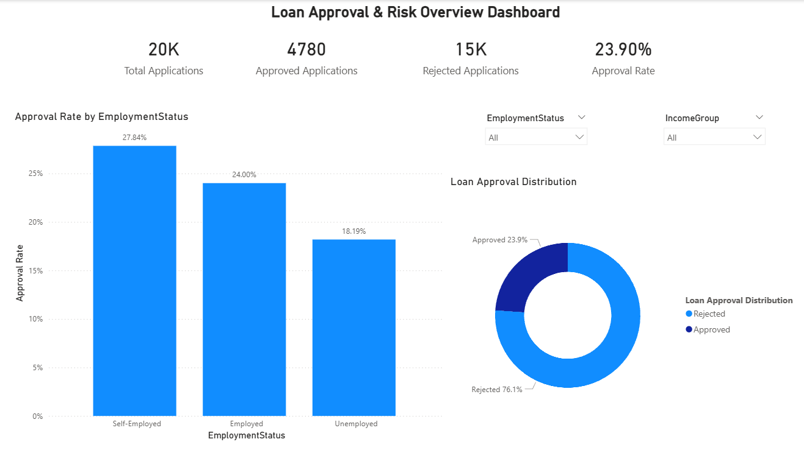
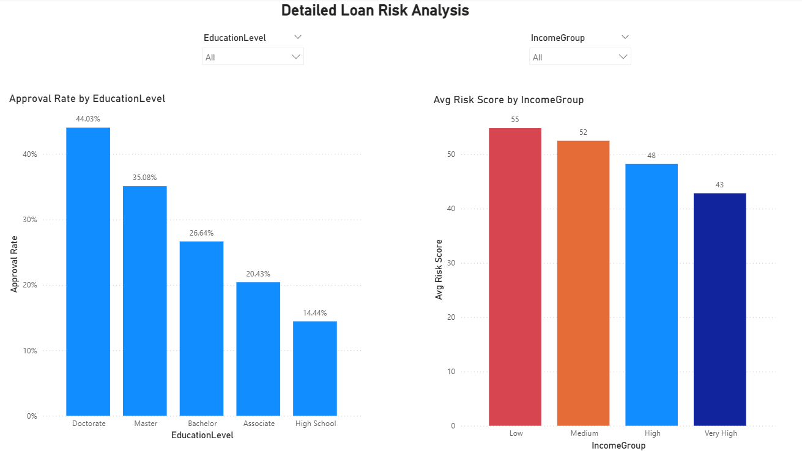

# 📊 Loan Risk Analysis – Project Summary

## 🎯 Objective
Analyze loan application data to identify key factors affecting loan approval and risk.

---

## 🧰 Tools Used
- Python (data preprocessing)
- SQL Server (data storage & querying)
- Power BI (dashboard visualization)

---

## 🔄 Workflow
1. Data cleaning and preprocessing
2. Data storage in SQL Server
3. Data aggregation using SQL queries
4. Dashboard development in Power BI

---

## 📊 Dashboard

### 🔹 Overview Dashboard

### 🔹 Detailed Dashboard

---

## 📌 Key Focus Areas
- Loan approval rate
- Risk score analysis
- Impact of income, education, and employment

---

## ✅ Outcome
Built an interactive dashboard that supports loan risk evaluation and decision-making.